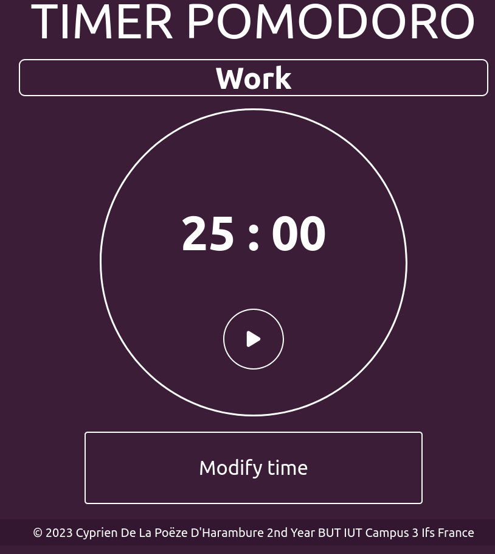

# 🍅 Pomodoro Web Timer 🕒

Welcome to the Pomodoro Web Timer application! 🚀

## What is it ❓

This timer is designed to help you stay focused and manage your work time effectively using the Pomodoro method. It allows you to set work and break periods, start and reset the timer as needed. It's a simple yet effective tool to boost your productivity.

## Features ✨

- ⏳ Set the duration of your work and break periods with user-friendly inputs.
- ▶️ Start the timer to begin your work session.
- 🔄 Reset the timer at any time to start your session over.
- 📈 Track your progress and stay focused with the Pomodoro method.

## How to use the application 📝

1. **Open the application** in your favorite web browser.

2. Use the inputs to **set the duration** of your work period (e.g., 25 minutes) and break period (e.g., 5 minutes).

3. Click the **arrow button** to start the timer. You can also click the square at any time to restart your session.

4. During the work period, **focus intensely** on your task.

5. When the timer reaches zero, the screen color will indicate it's time for a break. Enjoy your break to relax.

6. **Repeat the process** as many times as you wish to stay productive and focused.

## Screenshots 📸

## Development 💻

If you want to contribute to the development of this application, here's how to get started:

1. **Clone this repository**: `git clone https://github.com/Firim4r/Pomodoro.git`

2. **Contribute** by improving the code or adding new features.

## Author 👤

👤 **Cyprien De La Poëze D'Harambure**
- GitHub: [@Firim4r ](https://github.com/Firim4r)

Feel free to **report issues** or **suggest improvements** by opening an issue on this repository.

## Surprise 🎁

If your screen is a 1920 px wide, u can have a little suprise !